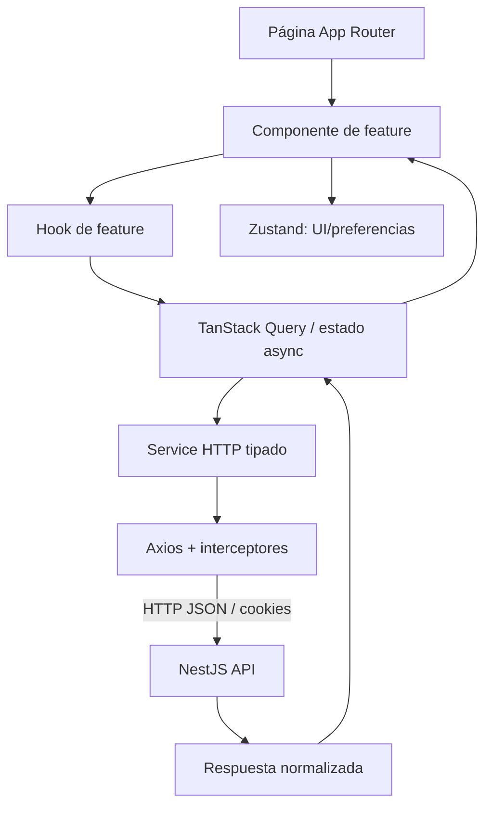

# FarmaSync Frontend

Aplicación web React sobre Next.js. Este repositorio es independiente del backend y consume la API NestJS mediante Axios; nunca accede directamente a PostgreSQL.

## Stack y responsabilidades

- **Next.js + React + TypeScript:** App Router, páginas y composición.
- **Axios:** cliente HTTP único, base URL e interceptores.
- **TanStack Query:** cache y ciclo de vida del estado remoto.
- **Zustand:** estado global de cliente y preferencias persistibles.
- **Shadcn/UI:** componentes visuales reutilizables sobre Tailwind.
- **React Hook Form + Zod:** formularios y validación declarativa.

## Estructura actual y objetivo

```text
src/
├── app/
│   ├── layout.tsx                # metadata y Providers
│   ├── providers.tsx             # QueryClientProvider
│   ├── page.tsx                  # landing inicial
│   ├── (auth)/                   # login, registro, recuperación
│   └── (dashboard)/              # shell y páginas autenticadas
├── components/
│   ├── layout/                   # composición de layout/estados
│   └── ui/                       # primitives Shadcn/UI
├── features/
│   ├── auth/                     # schemas, hooks, services y componentes
│   ├── medicines/
│   ├── reservations/
│   ├── notifications/
│   └── reports/
├── lib/
│   ├── http/axios.ts             # instancia e interceptores Axios
│   ├── api.ts                    # punto de exportación del cliente
│   └── utils.ts                  # cn() y utilidades puras
├── stores/ui.store.ts            # Zustand: estado de UI, no secretos
└── types/                        # tipos propios del cliente
```

Cada feature seguirá esta forma cuando tenga comportamiento:

```text
features/<feature>/
├── components/                   # render y eventos de usuario
├── hooks/                        # queries, mutations y estado de UI
├── services/                     # llamadas HTTP tipadas
├── schemas/                      # Zod + React Hook Form
└── types/                        # contratos del cliente
```

## Flujo de información



Reglas: ningún componente llama Axios/fetch; ningún service importa React; no duplicar entidades remotas en Zustand; no persistir contraseñas ni tokens.

## Configuración local

Requisitos: Node.js 22+ y npm.

```bash
npm ci
copy .env.example .env
npm run dev
```

La aplicación queda disponible en `http://localhost:3000`. El cliente usa `/api/v1` como URL relativa y el route handler proxy de Next.js comunica con `BACKEND_INTERNAL_URL` en runtime.

## Docker

La imagen contiene únicamente el frontend SSR. El backend y PostgreSQL se ejecutan fuera de esta imagen.

```bash
docker build --target runner -t farmasync-frontend .
docker run --rm --name farmasync-frontend -p 3000:3000 \
  -e BACKEND_INTERNAL_URL=http://host.docker.internal:3001/api/v1 \
  farmasync-frontend
```

Para que frontend y backend se resuelvan por nombre, conectarlos a una red Docker común y usar `BACKEND_INTERNAL_URL=http://farmasync-backend:3001/api/v1`. El Dockerfile usa build multi-stage, output standalone de Next.js y usuario no root.

## Comandos

| Comando | Propósito |
|---|---|
| `npm run dev` | Desarrollo Next.js |
| `npm run build` | Build standalone de producción |
| `npm run start` | Servir el build |
| `npm run lint` | ESLint |
| `npm test` | Pruebas Vitest |
| `npm run test:coverage` | Cobertura |

Las páginas funcionales actuales son placeholders de estructura. Las HU se implementarán por slices después de aprobar los bloqueantes funcionales.
